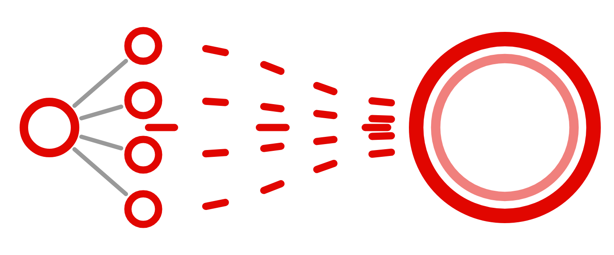
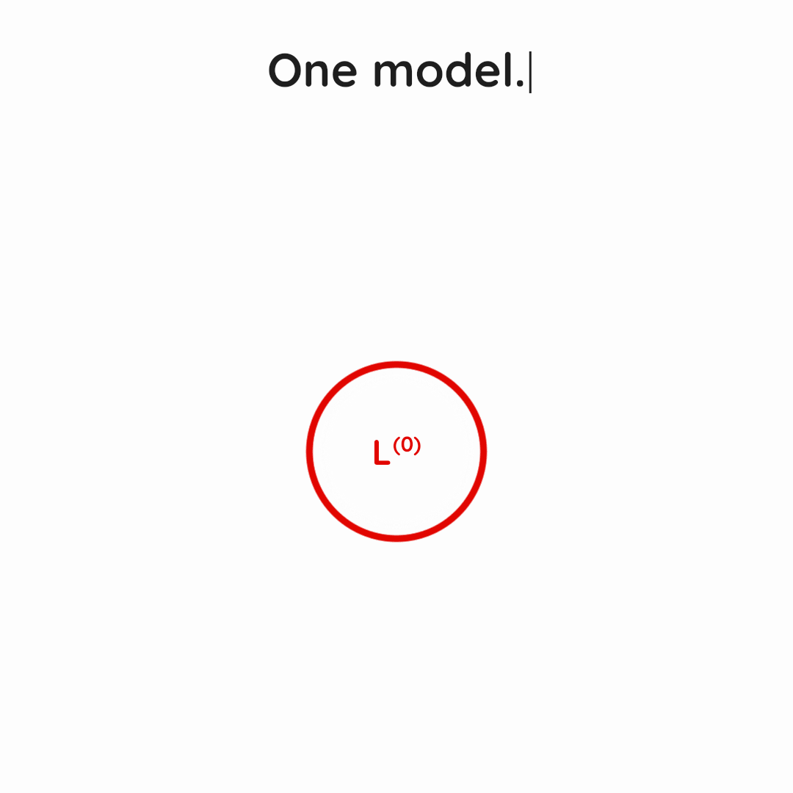

<p align="center">
  
</p>

<h1 align="center">MASS</h1>

<p align="center">
  <strong>Recursive Self-Improvement through Multi-Agent Self-Supervision</strong>
</p>

<p align="center">
  <a href="#overview">🧠 Overview</a> &nbsp;·&nbsp;
  <a href="#benchmark-results">📊 Results</a> &nbsp;·&nbsp;
  <a href="#quick-start">🚀 Quick start</a> &nbsp;·&nbsp;
  <a href="#run-a-mass-cycle">🔁 Pipeline</a> &nbsp;·&nbsp;
  <a href="#tasks-and-evaluation">🧪 Tasks &amp; evaluation</a> &nbsp;·&nbsp;
  <a href="#documentation">📚 Documentation</a>
</p>

<a name="overview"></a>

## 🧠 Overview

**MASS alternates between improving workflows and learning from them.**
RHI searches for multi-agent workflows while the model weights stay fixed.
Post-training uses trajectories from the selected workflows to update those
weights. The next cycle starts from the updated model.

<p align="center">
  
</p>

```text
L^(0) ── RHI → post-training ──> L^(1) ── RHI → post-training ──> L^(2)
```

We use the paper's notation $\mathcal{L}^{(k)}$ for the model after $k$ cycles.
The configuration files and output directories use `L0`, `L1`, and `L2` for
the same generations. Each cycle uses the current model as executor, optimizer,
and in-loop evaluator. The base model is Qwen3.6-27B, and each generation uses
qwen-code 0.20.0 as its coding-agent runtime.

This is a research implementation for running and extending the MASS pipeline.
The [experiment support](docs/experiment_coverage.md) and
[implementation notes](docs/reproduction.md) describe the available experiments
and differences from the reported runs.

<a name="benchmark-results"></a>

## 📊 Benchmark results

Results for the base model $\mathcal{L}^{(0)}$ and the models after one and two
MASS cycles. Task and trial counts are per model. ScienceAgentBench and delivery
rates are shown as percentages; other scores retain their reported scales.

| Benchmark | Tasks × trials | $\mathcal{L}^{(0)}$ | $\mathcal{L}^{(1)}$ | $\mathcal{L}^{(2)}$ |
|---|:---:|---:|---:|---:|
| [ScienceAgentBench](https://github.com/OSU-NLP-Group/ScienceAgentBench) (%) | 102 × 3 | 28.8 ± 1.5 | 30.4 ± 2.0 | 31.7 ± 2.0 |
| [MLR-Bench](https://github.com/chchenhui/mlrbench) | 107 × 3 | 1.71 ± 0.08 | 1.77 ± 0.09 | 2.25 ± 0.06 |
| [MLR-Bench](https://github.com/chchenhui/mlrbench) papers delivered | 107 × 3 | 57% | 59% | 76% |
| [AstaBench (E2E-Bench-Hard)](https://github.com/allenai/asta-bench#discovery-tasks-discovery) | 40 × 3 | 0.053 ± 0.002 | 0.055 ± 0.004 | 0.067 ± 0.017 |
| [AstaBench (E2E-Bench-Hard)](https://github.com/allenai/asta-bench#discovery-tasks-discovery) reports delivered | 40 × 3 | 50% | 58% | 76% |
| [DSBench](https://github.com/LiqiangJing/DSBench) | 74 × 3 | 0.473 ± 0.029 | 0.465 ± 0.011 | 0.482 ± 0.025 |
| [Terminal-Bench 2.0](https://github.com/harbor-framework/terminal-bench-2) | 89 × 2 | 0.373 ± 0.030 | 0.351 ± 0.030 | 0.362 ± 0.003 |
| [SWE-bench Verified](https://huggingface.co/datasets/princeton-nlp/SWE-bench_Verified) | 500 × 1 | 0.635 | 0.597 | 0.605 |

A single score is shown for evaluations with one trial. Delivery rates are
reported separately from the MLR-Bench and AstaBench scores. The
[AstaBench breakdown](benchmarks/README.md#astabench-e2e-bench-hard-results)
includes trial scores, report counts, and scores among delivered reports. See the
[benchmark resources](benchmarks/README.md#official-benchmark-resources) for
official papers and code or data.

The packaged MLR-Bench configuration covers an earlier 12-task subset. The
107-task configuration and evaluation adapters for AstaBench (E2E-Bench-Hard),
DSBench, Terminal-Bench 2.0, and SWE-bench Verified are not included. See
[experiment support](docs/experiment_coverage.md) for the available runners.

<a name="whats-included"></a>

## ✨ What's included

- **Workflow search:** RHI, trajectory collection, and within-task ranking.
- **Post-training:** conversation rendering, assistant-only loss masks, LoRA,
  validation-loss checkpoint selection, and BF16/FP8 model export.
- **12 synthetic tasks:** every task prompt and initial workflow, with the
  nine-task training split and three-task test split.
- **Evaluation:** synthetic-task pairwise judging and ScienceAgentBench/MLR-Bench
  adapters.
- **Two MASS cycles:** separate configurations for the first and second updates.

The code runs independently of the original research repository. Model weights,
task datasets, trajectories, and checkpoints are downloaded or generated when
needed.

<a name="quick-start"></a>

## 🚀 Quick start

### 1. Preview the pipeline

From your cloned `mass` directory, preview the first cycle and run the offline
tests. These commands need no GPU or model server:

```bash
python3 -m mass plan --config configs/paper.json
python3 -m unittest discover -s tests -v
```

`plan` prints the configuration and training command without executing them.
The tests use small fixtures and make no model calls. The RHI integration test
requires [the core dependencies](requirements-core.txt) and is skipped when
they are unavailable.

### 2. Run your first search

For an actual experiment, follow the [setup guide](docs/running.md). It covers
Python environments, model downloads, vLLM serving, and GPU allocation. Once
the model server is running, you can start with a single task:

```bash
python -m mass search --config configs/paper.json --tasks 51
```

This uses the configured search budget. The [single-task example](docs/running.md#try-one-task)
shows how to use a shorter search in a separate run directory.

<a name="run-a-mass-cycle"></a>

## 🔁 Run a MASS cycle

The stages are separate commands so that you can inspect intermediate outputs
and resume completed work.

| Command | Output |
|---|---|
| `search` | Proposed workflows, execution workspaces, and a retained workflow per task |
| `collect` | Candidate trajectories from the retained workflows |
| `rank` | Within-task comparisons and trajectory rankings |
| `select` | Training and validation trajectory manifests |
| `render` | Tokenized conversations and assistant-only loss masks |
| `train` | LoRA checkpoints and validation losses |
| `export` | The selected checkpoint merged into BF16 and FP8 models |

Run a stage with `python -m mass <stage> --config <config>`.

| Cycle | Model update | Configuration |
|---|---|---|
| First | $\mathcal{L}^{(0)} \to \mathcal{L}^{(1)}$ | [configs/paper.json](configs/paper.json) |
| Second | $\mathcal{L}^{(1)} \to \mathcal{L}^{(2)}$ | [configs/cycle2.json](configs/cycle2.json) |

The second cycle trains a fresh LoRA adapter on the merged first-cycle model.
The [run guide](docs/running.md) gives the complete command sequence.

For each eligible training task, ranks 1–15 enter training and rank 16 enters
validation. The saved checkpoint with the lowest validation loss is selected.
External judges are used for reporting, separately from this training loop.

<a name="tasks-and-evaluation"></a>

## 🧪 Tasks and evaluation

The synthetic tasks cover finance, pharmacy, and robotics:

| Split | Task IDs |
|---|---|
| Training | 51, 53, 56, 202, 205, 221, 302, 307, 324 |
| Test | 60, 207, 305 |

Task 221 is included in the repository but was excluded from teacher collection
in the reported experiment; the remaining eight training tasks contributed SFT
data. Test tasks do not enter SFT or checkpoint selection. See the
[task index](tasks/README.md) for every prompt and initial workflow, or
[tasks/splits.json](tasks/splits.json) for the machine-readable split.

Use `rollout` and `report` for [synthetic-task evaluation](docs/running.md#synthetic-task-evaluation).
The [public benchmark guide](benchmarks/README.md) describes ScienceAgentBench
and MLR-Bench evaluation with $\mathcal{L}^{(k)}$ + qwen-code.

<a name="repository-layout"></a>

## 🗂️ Repository layout

| Path | Contents |
|---|---|
| [mass/](mass/) | Pipeline commands and trajectory selection |
| [configs/](configs/) | Cycle settings and base-model revisions |
| [tasks/](tasks/) | Task prompts, initial workflows, and teacher directive |
| [harness_improvement/](harness_improvement/) | RHI feedback, workflow history, and updates |
| [runtime/](runtime/) | Episode runner and request logging proxy |
| [training/](training/) | Conversation rendering, LoRA training, and model export |
| [evaluation/](evaluation/), [evaluation_claudecodex/](evaluation_claudecodex/) | Workspace evidence and pairwise judging |
| [benchmarks/](benchmarks/) | Public benchmark setup, execution, and scoring |
| [tests/](tests/) | Offline tests |
| [tools/](tools/) | Model downloads, rollout pairing, and source archive utilities |
| [assets/](assets/) | Teaser figure and animated overview |

<a name="documentation"></a>

## 📚 Documentation

| Start here to… | Guide |
|---|---|
| Set up an experiment | [Installation and running](docs/running.md) |
| Explore the synthetic tasks | [Task prompts and splits](tasks/README.md) |
| Run ScienceAgentBench or MLR-Bench | [Public benchmarks](benchmarks/README.md) |
| Connect the paper to the code | [Notation and training settings](docs/paper_to_code.md) |
| Check which experiments are included | [Experiment support](docs/experiment_coverage.md) |
| Understand protocol differences | [Implementation notes](docs/reproduction.md) |
| Run tests or build a source ZIP | [Development guide](docs/development.md) |

This repository supports the pipeline and benchmarks listed above; it does not
include every paper ablation or analysis. The current RHI driver uses
fixed-reference comparisons and champion arbitration, which differs from
Algorithm 1's direct comparison with the retained best output. The experiment
support and implementation notes describe these differences and the current
evaluation limitations.

## 🤝 Contributing

See [CONTRIBUTING.md](CONTRIBUTING.md) for changes, bug reports, and experiment
extensions. [NOTICE.md](NOTICE.md) covers third-party software and data.
