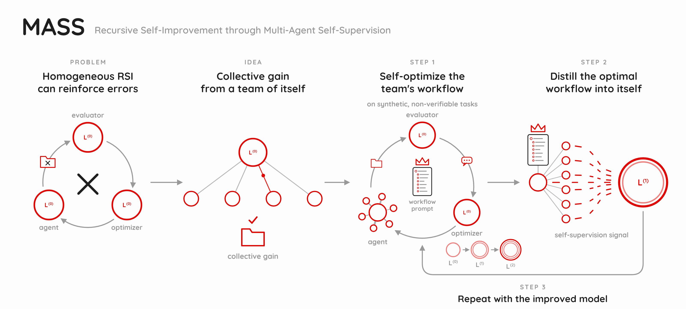

# MASS: Multi-Agent Self-Supervision



MASS alternates between automatic workflow updates (RHI) and post-training.
RHI searches for multi-agent workflows with a fixed language model. The model
then learns from trajectories generated under the selected workflows, and the
next cycle starts from the updated weights.

This is a research implementation for running and extending the MASS pipeline.
The [experiment support](docs/experiment_coverage.md) and
[implementation notes](docs/reproduction.md) describe the available experiments
and differences from the reported runs.

```text
L^(0) ── RHI → post-training ──> L^(1) ── RHI → post-training ──> L^(2)
```

We use the paper's notation $\mathcal{L}^{(k)}$ for the model after $k$ cycles.
The configuration files and output directories use `L0`, `L1`, and `L2` for
the same generations. The base model is Qwen3.6-27B, and each generation uses
qwen-code 0.20.0 as its coding-agent runtime.

## What's included

- Workflow search, trajectory collection, and within-task ranking.
- Conversation rendering, LoRA training, validation-loss checkpoint selection,
  and BF16/FP8 model export.
- All 12 synthetic research tasks, with their initial workflows and train/test
  split.
- Synthetic-task pairwise evaluation and ScienceAgentBench/MLR-Bench adapters.
- Separate configurations for the first and second MASS cycles.

The code runs independently of the original research repository. Model weights,
task datasets, trajectories, and checkpoints are downloaded or generated when
needed.

## Quick start

From your cloned `mass` directory, preview the first cycle and run the offline tests:

```bash
python3 -m mass plan --config configs/paper.json
python3 -m unittest discover -s tests -v
```

`plan` prints the configuration and training command without executing them.
The tests use small fixtures and make no model calls. The RHI integration test
requires the core dependencies and is skipped when they are unavailable.

For an actual experiment, follow the [setup guide](docs/running.md). It covers
Python environments, model downloads, vLLM serving, and GPU allocation. Once
the model server is running, you can start with a single task:

```bash
python -m mass search --config configs/paper.json --tasks 51
```

This uses the configured search budget. The [single-task example](docs/running.md#try-one-task)
shows how to use a shorter search in a separate run directory.

## Run a MASS cycle

The stages are separate commands so that you can inspect intermediate outputs
and resume completed work.

| Command | Output |
|---|---|
| `search` | Proposed workflows, execution workspaces, and a retained workflow per task |
| `collect` | Candidate trajectories from the retained workflows |
| `rank` | Within-task comparisons and trajectory rankings |
| `select` | Training and validation trajectory manifests |
| `render` | Tokenized conversations and assistant-only loss masks |
| `train` | LoRA checkpoints and validation losses |
| `export` | The selected checkpoint merged into BF16 and FP8 models |

Run a stage with `python -m mass <stage> --config <config>`.
Use [configs/paper.json](configs/paper.json) for $\mathcal{L}^{(0)} \to \mathcal{L}^{(1)}$
and [configs/cycle2.json](configs/cycle2.json) for $\mathcal{L}^{(1)} \to \mathcal{L}^{(2)}$.
The second cycle trains a fresh LoRA adapter on the merged first-cycle model.
The [run guide](docs/running.md) gives the complete command sequence.

The current $\mathcal{L}^{(k)}$ serves as executor, evaluator, and optimizer.
For each eligible training task, ranks 1–15 enter training and rank 16 enters
validation. The saved checkpoint with the lowest validation loss is selected.
External judges are used for reporting, separately from this training loop.

## Tasks and evaluation

The synthetic tasks cover finance, pharmacy, and robotics:

| Split | Task IDs |
|---|---|
| Training | 51, 53, 56, 202, 205, 221, 302, 307, 324 |
| Test | 60, 207, 305 |

Task 221 is included in the repository but was excluded from teacher collection
in the reported experiment; the remaining eight training tasks contributed SFT
data. Test tasks do not enter SFT or checkpoint selection. See the
[task index](tasks/README.md) for every prompt and initial workflow, or
[tasks/splits.json](tasks/splits.json) for the machine-readable split.

Use `rollout` and `report` for [synthetic-task evaluation](docs/running.md#synthetic-task-evaluation).
The [public benchmark guide](benchmarks/README.md) describes ScienceAgentBench
and MLR-Bench evaluation with $\mathcal{L}^{(k)}$ + qwen-code.

## Repository layout

| Path | Contents |
|---|---|
| `mass/` | Pipeline commands and trajectory selection |
| `configs/` | Cycle settings and base-model revisions |
| `tasks/` | Task prompts, initial workflows, and teacher directive |
| `harness_improvement/` | RHI feedback, workflow history, and updates |
| `runtime/` | Episode runner and request logging proxy |
| `training/` | Conversation rendering, LoRA training, and model export |
| `evaluation/`, `evaluation_claudecodex/` | Workspace evidence and pairwise judging |
| `benchmarks/` | Public benchmark setup, execution, and scoring |
| `tests/` | Offline tests |
| `tools/` | Model downloads, rollout pairing, and source archive utilities |

## Documentation

- [Setup and running experiments](docs/running.md)
- [Task prompts and splits](tasks/README.md)
- [Public benchmarks](benchmarks/README.md)
- [Paper notation and training settings](docs/paper_to_code.md)
- [Experiment support](docs/experiment_coverage.md)
- [Implementation notes and current limitations](docs/reproduction.md)
- [Development and source archives](docs/development.md)
- [Contributing](CONTRIBUTING.md)
- [Third-party software and data](NOTICE.md)

This repository supports the pipeline and benchmarks listed above; it does not
include every paper ablation or analysis. The current RHI driver uses
fixed-reference comparisons and champion arbitration, which differs from
Algorithm 1's direct comparison with the retained best output. The experiment
support and implementation notes describe these differences and the current
evaluation limitations.
